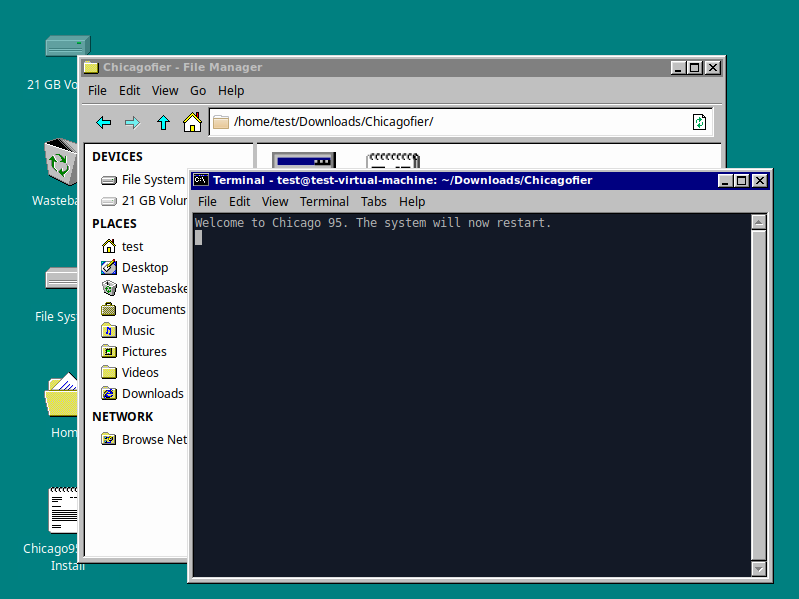

# Chicagofier
#### Unofficial fan-made script for transforming a system with the [Chicago95](https://github.com/grassmunk/Chicago95) theme (currently only supports Xubuntu)

Chicago95 is an AMAZING theme for XFCE, however its held back by its Terminal-heavy installation procedure for getting the full transformation*. This script is a script that transforms an install of XFCE with very little user interaction required, making the whole transformation more noob-friendly to pull off. Additionally, it also includes some patches for the Chicago95 experience, and integrates Chicago95 Plus into the applications menu.

*You can also use the repository and .deb packages, though, if that suits you. No idea how much of the transformation happens when doing this method in Xubuntu, though. If anyone wants to contribute distro-agnostic-ness to this script, however, I guess it'd have the additional point of being a noob-friendlier method for other Linux Distros there aren't yet Chicago95 packages for (e.g.: Solus).

#### Patches to Chicago95:

- The 'No CSD' CSS is enabled for Chicago95 GTK3 (since this installs gtk3-nocsd)
- Chicago95 Plus's storage has been moved to a hidden folder in your Home Folder instead of populating Pictures with its files

#### Requirements

- Xubuntu 18.04 or newer (only tested on Xubuntu 20.04)
- Being logged in as an administrator account (first user's an administrator)

#### Notes

- Firefox will be (with your permission) replaced with Epiphany during installation since Firefox looks bad/unfitting for one (especially in this theme) and two Epiphany fits better in this theme

-----

## Installation

### Step 1

Download Chicagofier from [Releases](https://github.com/dominichayesferen/Chicagofier/releases) (a 'Source Code' download).

### Step 2

Extract the downloaded file with your archive manager (right-click, Extract Here).

### Step 3

Open a Terminal in the current folder.

### Step 4

Run the script in the Terminal window (`bash ./chicagofier.sh`) and then read the message shown, followed by pressing ENTER and inputting your password after.

### Step 5

Leave the Terminal to do its thing. Eventually it'll end up asking you if you'd like to replace Firefox with another browser. When it does, choose as you'd like. It is your choice if you replace Firefox or not.

### Step 6

Leave the Terminal to do its thing, again. Eventually it'll end up showing the screen shown in the image below.

### Step 6

Go through the Setup process while leaving everything on their defaults.

### Step 7

Again, let the installation happen.

### Step 8

Once it's done, you'll see this page of Setup, and a Text Editor window. Click 'Finish'.

### Step 9

Your computer will restart. But you're not done yet.

### Step 10

To finish things off, open the "Chicago95 Post-Install" file on your Desktop, and follow the instructions on there ("XFCE Settings Manager" is the Settings window).

#### TIP: In the Browse Icons dialog, change the 'select icons from' to "Image Files" and then right-click the files pane and select "Show Hidden Files" to see the .themes folder when applying the icon for the Whisker Start button.

### Step 11

You're done, enjoy Chicago95!

-----

## Screenshots

-----

### Code and license
License: GPL-2.0 (check [Chicago95's own repository](https://github.com/grassmunk/Chicago95) for their own license)
